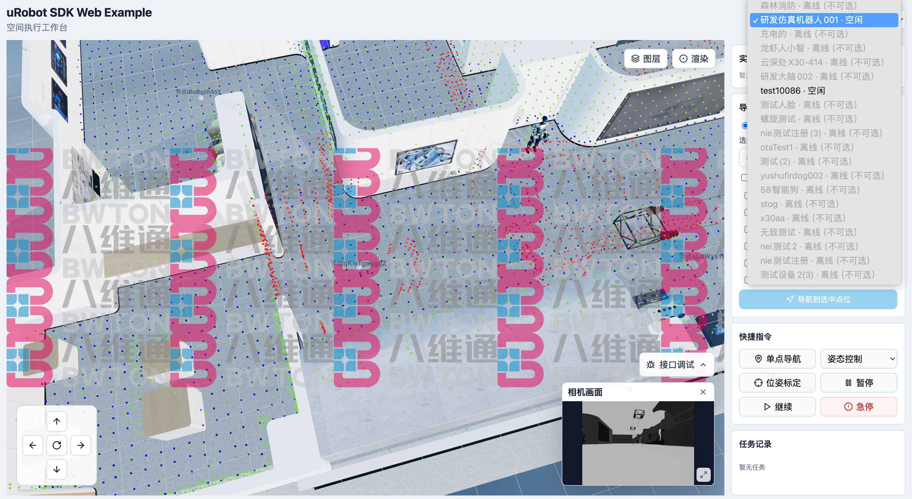

# urobot-sdk-example

uRobot SDK Example 是 uTwin 机器人平台的全栈 SDK 示例应用。项目初始状态仅有一个 Spring Boot WebFlux 后端脚手架（含机器人列表端点）和空白前端。需要补全完整的前后端链路，包括 3D 空间可视化、机器人执行控制、后端 API 端点。 

当前后端使用 Java 8 / Spring Boot WebFlux，依赖内部 `utwin-opensdk-core` 和 `utwin-opensdk-services`。

前端基于 React 18 / Vite / TypeScript，3D 渲染使用 SoonSpace.js（内置 Three.js）。

# [API Documentation](https://bwtrobot.github.io/urobot-sdk-example/)

## Goals

- 提供一个可运行的全栈 SDK 示例，展示 uTwin 平台核心能力
- 前端在后端不可用时自动降级为演示模式（Mock 数据）
- 3D 场景支持 BIM 模型、PCD 点云、机器人位姿、导航路径的分层渲染
- ROS 坐标系到 Three.js 坐标系的统一变换
